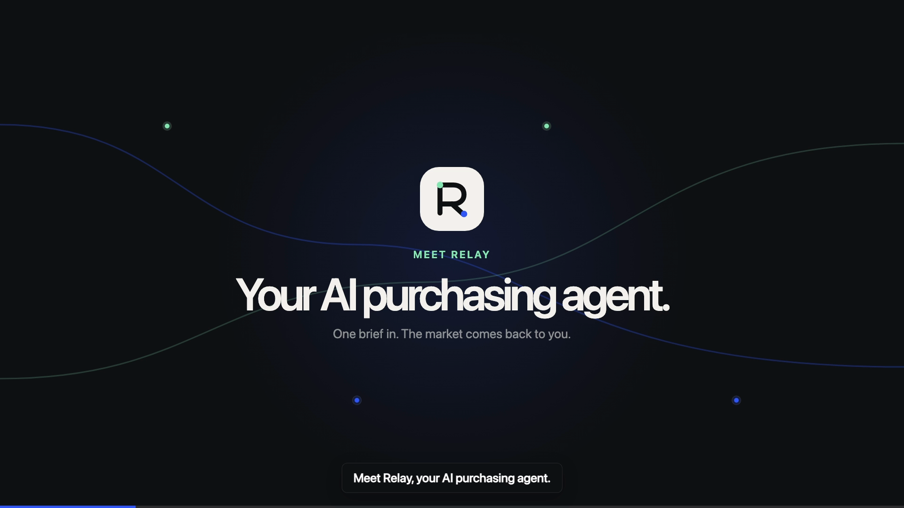
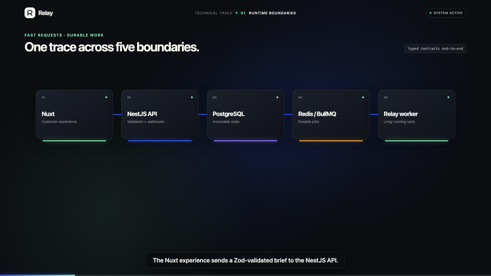
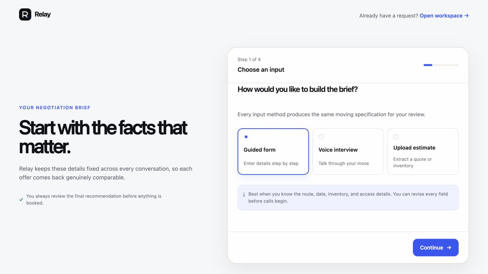
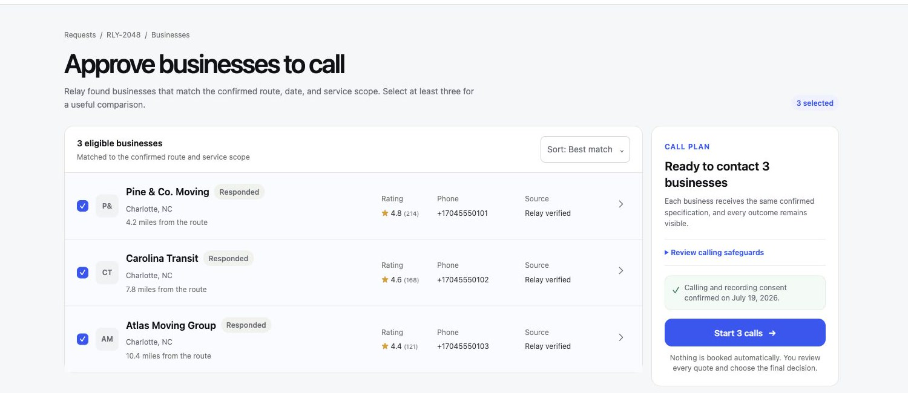
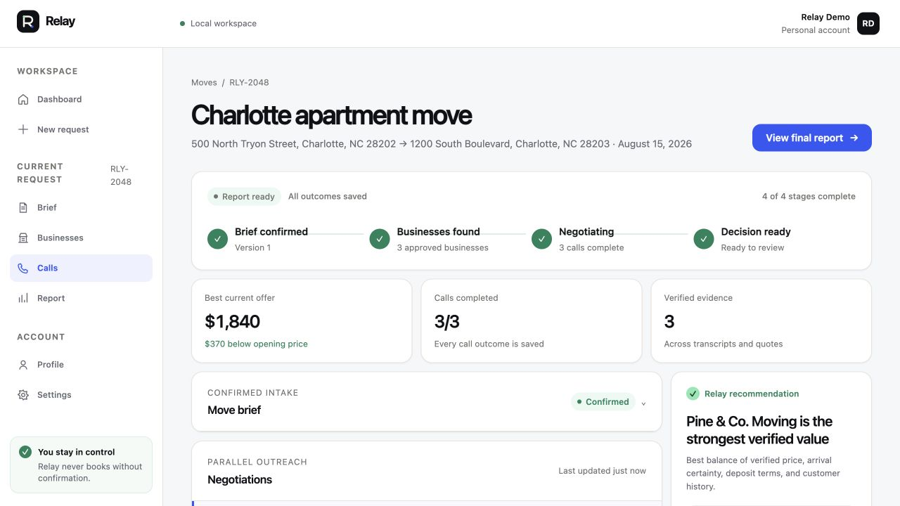
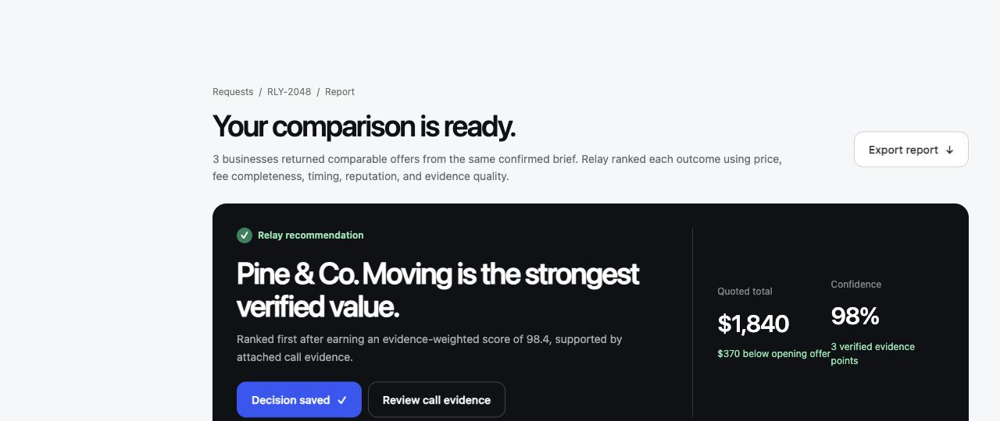

# Relay

Relay is an AI purchasing agent that gathers comparable phone quotes, negotiates truthfully, and recommends the best verified offer with evidence.

The first product experience focuses on moving services: a customer confirms one complete job brief, Relay contacts multiple movers with the same facts, normalizes every fee, and explains the strongest deal without inventing leverage.

| 60-second product demo                                                                                     | 59-second technical overview                                                                                                       |
| ---------------------------------------------------------------------------------------------------------- | ---------------------------------------------------------------------------------------------------------------------------------- |
| [](assets/demo/relay-demo.mp4) | [](assets/demo/relay-tech-overview.mp4) |

[Watch the 60-second product demo](assets/demo/relay-demo.mp4) · [Watch the 59-second technical overview](assets/demo/relay-tech-overview.mp4)

## Product walkthrough

| Build one complete brief                                                                        | Approve the businesses Relay will call                                                           |
| ----------------------------------------------------------------------------------------------- | ------------------------------------------------------------------------------------------------ |
|  |  |

| Follow calls, quotes, and evidence                                                                                           | Compare the final verified recommendation                                                            |
| ---------------------------------------------------------------------------------------------------------------------------- | ---------------------------------------------------------------------------------------------------- |
|  |  |

[Read the hackathon submission copy](docs/challenge/hackathon-submission.md), including the problem, audience, features, implementation, and demonstrated impact.

## Current foundation

Relay is a private pnpm and Turborepo monorepo. The frontend is built with Nuxt and Vue; the API and background worker use NestJS. Internal workspaces use the final `@relay/*` scope.

The repository pins:

- Node.js `24.18.0`
- pnpm `11.15.0`
- PostgreSQL `18.4` on Alpine `3.23` for local persistence
- Exact dependency versions in every package manifest
- Current CI action releases by immutable commit SHA

## Quick start

Activate Node.js `24.18.0` from `.nvmrc` or `.node-version`, then run:

```bash
corepack enable
pnpm install
cp .env.example .env
docker compose -f infra/compose.yaml up -d
pnpm db:generate
pnpm db:push
pnpm db:seed
pnpm dev
```

Local endpoints:

- Relay web experience: `http://localhost:3000`
- API health: `http://localhost:4000/api/v1/health`

PostgreSQL is required for the complete persisted product flow. Redis is used by the durable live queue; fixture mode can use the in-memory queue. The local Compose stack starts both. PostgreSQL is pinned to 18.4 and uses the PostgreSQL 18 volume layout. Local database data is disposable; `pnpm db:reset` is destructive and must only target that disposable local database.

## Repository map

```text
apps/
  web/                 Nuxt customer experience and product workspace
  api/                 NestJS HTTP, webhook, validation, and enqueueing boundary
  worker/              Long-running call and quote orchestration process
  video/               Editable Relay product film and rendering workflow
packages/
  contracts/           Shared schemas, DTOs, events, and job payloads
  domain/              Provider-independent quote and negotiation policy
  verticals/           Configuration for moving and future markets
  database/            Prisma schema and database client
  queue/               Queue names and typed job contracts
  integrations/        Server-only provider ports and adapters
  ui/                   Framework-neutral Relay design tokens and styles
  eslint-config/        Shared lint configuration
  typescript-config/    Shared strict compiler configuration
docs/                   Product, architecture, delivery, and operations details
assets/brand/           Production Relay identity and archived explorations
assets/demo/            Published product demo and poster assets
infra/                  Local services and production container definitions
```

Applications may depend on packages; packages never depend on applications. Provider SDKs stay behind server-only integration boundaries, while the Nuxt application consumes browser-safe contracts and the Relay UI foundation.

## Common commands

| Command                  | Purpose                                                  |
| ------------------------ | -------------------------------------------------------- |
| `pnpm dev:web`           | Run the Nuxt frontend.                                   |
| `pnpm dev:api`           | Run the API locally.                                     |
| `pnpm dev:worker`        | Run the background worker.                               |
| `pnpm video:dev`         | Open the editable Relay video composition.               |
| `pnpm video:render`      | Render the MP4, WebM, and poster assets.                 |
| `pnpm video:render:tech` | Render the technical MP4, WebM, and poster assets.       |
| `pnpm build`             | Build every application and package in dependency order. |
| `pnpm lint`              | Run repository lint checks.                              |
| `pnpm typecheck`         | Run strict TypeScript checks.                            |
| `pnpm test`              | Run credential-free automated tests.                     |
| `pnpm format:check`      | Verify formatting.                                       |
| `pnpm check`             | Run the complete local quality gate.                     |
| `pnpm db:generate`       | Generate the Prisma client.                              |
| `pnpm db:validate`       | Validate the Prisma schema.                              |

## Project details

- [Documentation index](docs/README.md)
- [Product overview](docs/product/overview.md)
- [Requirements](docs/product/requirements.md)
- [Architecture overview](docs/architecture/overview.md)
- [Repository boundaries](docs/architecture/repository-layout.md)
- [Relay brand system](docs/design/brand.md)
- [Relay demo video package](apps/video/README.md)
- [Hackathon submission copy](docs/challenge/hackathon-submission.md)
- [Environment catalog](docs/development/environment.md)
- [Production deployment](docs/operations/production-deployment.md)
- [Execution task list](docs/project/task-list.md)
- [Preserved source material](docs/references/README.md)

Relay is private, proprietary project software. Distribution and access are controlled by the project owner.
