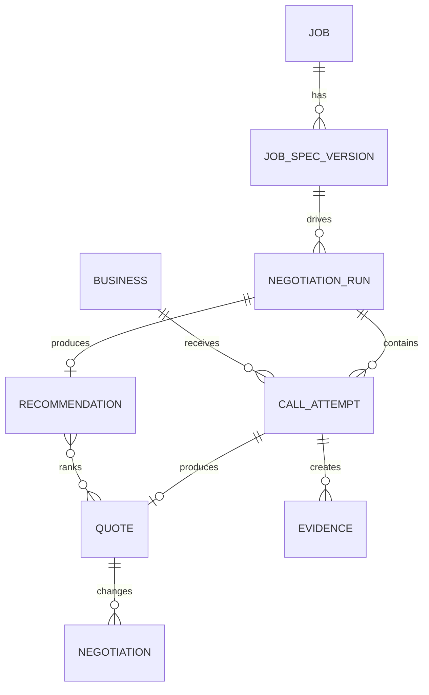

# Conceptual data model

Status: Canonical concept; Prisma schema is implementation source  
Owner: Engineering  
Last reviewed: 2026-07-19

## Core records

### Job

Represents the customer's purchasing request and current lifecycle. It owns one or more immutable specification versions and negotiation runs.

Key fields: identifier, owner identifier, vertical key, status, created/updated timestamps.

### Job specification version

Contains the exact confirmed facts reused across calls: pickup, destination, rooms, inventory, access constraints, moving date, budget, notes, source metadata, and confirmation timestamp. A content digest supports comparison and audit.

### Business

Represents a discovered counterparty with normalized phone number, location, rating, review count, discovery provider, and provider identifier.

### Negotiation run

Groups the set of comparable calls and final report for one confirmed specification version. It carries run status, configuration version, market benchmark, and timestamps.

### Call attempt

Represents one provider session with one business. It stores attempt status, provider references, timing, structured terminal outcome, disclosure state, consent state, and error details safe for internal diagnosis.

### Quote

Stores currency, itemized fees, discounts, total, binding/estimate classification, completeness, confidence, expiry, assumptions, risk flags, and evidence references. Missing values remain missing rather than becoming zero.

### Negotiation

Records the truthful strategy used, compatible leverage quote, price or terms before and after, saved amount, transcript evidence, and policy evaluation.

### Evidence

References transcripts, recordings, uploaded documents, extracted spans, and provider metadata stored outside large relational rows when appropriate. It carries access class, retention deadline, and integrity metadata.

### Recommendation

Stores ranked quote identifiers, scoring factors, explanation, best-value selection, savings metrics, and the policy/configuration versions used to produce it.

## Relationships

## Money and confidence

Money is stored as integer minor units plus ISO currency. Confidence is an explicit bounded score with reason/source metadata, not a label inferred from whether a value exists. Quote totals should be reproducible from itemization or carry a visible reconciliation difference.

## Retention

Core job and quote records may outlive raw voice evidence. Recordings, transcripts, documents, and extracted personal information need separate retention and access policies so evidence can expire without corrupting the comparison history.
