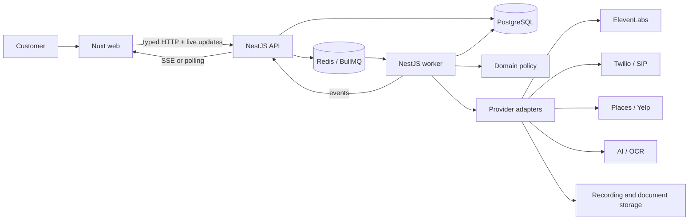

# Architecture overview

Status: Canonical foundation  
Owner: Engineering  
Last reviewed: 2026-07-19

Relay separates fast customer-facing requests from long-running voice work. The API validates and persists intent, while a worker owns calls, retries, quote extraction, negotiation, and reporting. Shared packages contain contracts and policy without depending on an application framework.

## Runtime responsibilities

### Web

Owns intake, review, consent, live status, comparison, evidence navigation, and recommendation presentation. It may import only browser-safe shared packages such as UI and contracts. Server credentials never enter its bundle.

### API

Owns authentication boundaries, request validation, job-specification versioning, provider webhook ingress, persistence coordination, and queue enqueueing. It returns quickly and does not keep voice calls alive inside HTTP requests.

### Worker

Owns discovery jobs, call sessions, retries, conversation orchestration, quote extraction, negotiation attempts, evidence association, and report generation. It is a separately deployable persistent process.

### Shared packages

- Contracts define input, output, event, and queue schemas.
- Domain contains deterministic normalization, red flags, ranking, and negotiation constraints.
- Verticals supply market configuration.
- Database owns the Prisma schema and client.
- Queue owns names and payload contracts, not processors.
- Integrations expose provider ports and server-only adapters.
- UI owns browser-safe design tokens and framework-neutral styles.

## Primary data path

1. The API persists a draft job specification assembled from voice and documents.
2. User confirmation creates an immutable version identifier.
3. The API creates a negotiation run and its outbox event in one transaction.
4. Queue messages contain stable record identifiers; the worker reloads the confirmed version and executes provider operations idempotently.
5. Domain policy normalizes and scores completed quotes.
6. Progress events update the web without blocking the worker.
7. The final report references the exact job version, calls, transcripts, recordings, quotes, flags, and recommendation factors.

## Deployment shape

The web produces a Nuxt/Nitro build for a compatible Node or edge host. The API and worker require runtimes suitable for webhooks, persistent processes, and long-running queue work. PostgreSQL, Redis, and object storage remain independent managed services in production.
