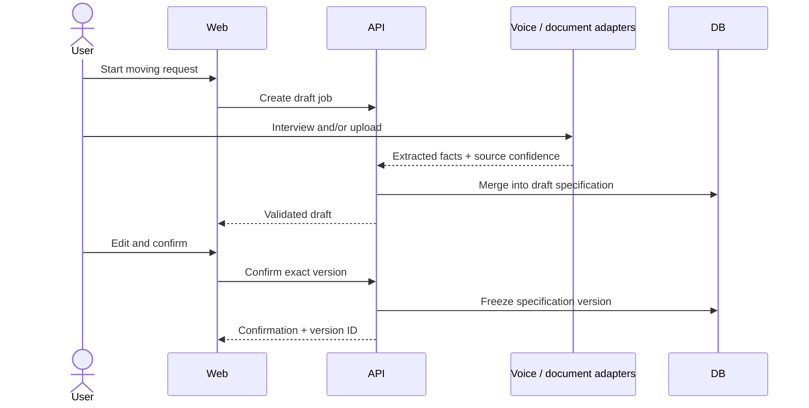
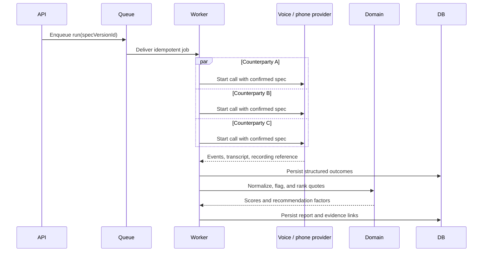

# Core workflows

Status: Canonical foundation  
Owner: Engineering and product  
Last reviewed: 2026-07-19

## Intake to confirmed specification



A confirmed specification is immutable. Corrections create a new version. Quotes gathered for different material versions are not treated as directly comparable.

## Call and negotiation run



## State models

Job specification:

```text
draft -> ready_for_review -> confirmed -> superseded
```

Negotiation run:

```text
draft -> queued -> discovering -> calling -> comparing -> completed
                                       \-> partially_completed
                                       \-> failed
```

Call attempt:

```text
queued -> dialing -> connected -> gathering_quote -> negotiating
                                               \-> callback
                                               \-> quoted
                                               \-> declined
                         \-> failed / canceled
```

All transitions record an occurred-at timestamp, actor or provider, correlation ID, and reason when the transition represents failure, cancellation, decline, or manual intervention.

## Idempotency

Queue jobs and provider webhooks use stable keys derived from the run, target business, attempt number, and provider event ID. A retry may repeat safe reads and provider lookups but cannot create a second logical call, quote, or negotiation record for the same idempotency key.
